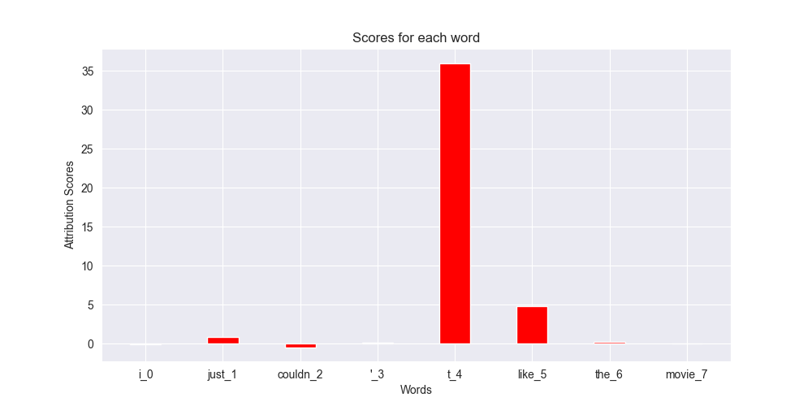

# Input-Marginalization
Unofficial PyTorch implementation of the paper "Interpretation of NLP models through input marginalization"


You can try it out in command line as follows:
First, clone the repo and install the required packages:
```
git clone 
pip install -r requirements.txt
```
By default it interprets a [model trained on sentiment analysis task](https://huggingface.co/textattack/bert-base-uncased-SST-2) available on huggingface model hub.  
To calculate attribution scores for an input sentence and a given label (1 for postive sentiment and 0 for negative):
```
python calculate_score.py\ 
--sent "I just couldn't like that movie"\
--label 0 
```
The above command will produce a matplotlib figure as shown below:
The higher the score for a word, higher is it's importance in prediction of label. We can see below that negative assertion before the word "like" received a large score since it's absence would basically change the sentiment of sentence.



Also true label given by you, predicted label along with the confidence and the attribution scores would be logged.


You can interpret your own huggingface finetuned model on a task by tweaking the following optional arguments:

* `--target_model`: Model you want to interpet. Default is `BertForSequenceClassification.from_pretrained("textattack/bert-base-uncased-SST-2")`
* `--language_model`: Language model to be used in input marginalization. Default is `BertForMaskedLM.from_pretrained("bert-base-uncased")`
* `--tokenizer`: Tokenizer to use to preprocess the input sentence. Default is `BertTokenizer.from_pretrained("bert-base-uncased)`


## Paper Summary:

Most of the techniques for calculating attribution scores for inputs to a model, zero out the input tokens entirely and then note the change in the predicted labels confidence. This method has one shortcoming: Replacing an input token id with 0 token is essentially replacing the tokens with `[PAD]` token. This input is completely out of distribution inputs to the model. There will never occur a sentence in the wild which has `[PAD]` token. This paper proposes to instead iteratively replace the token with each token from the vocabulary other than itself and note the change in confidence of predicted labels. We should do this with each token of sentence to calculate the effect of all the tokens on predicted label.
